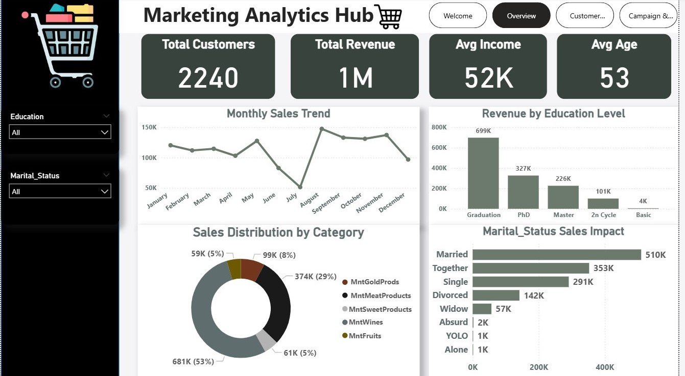
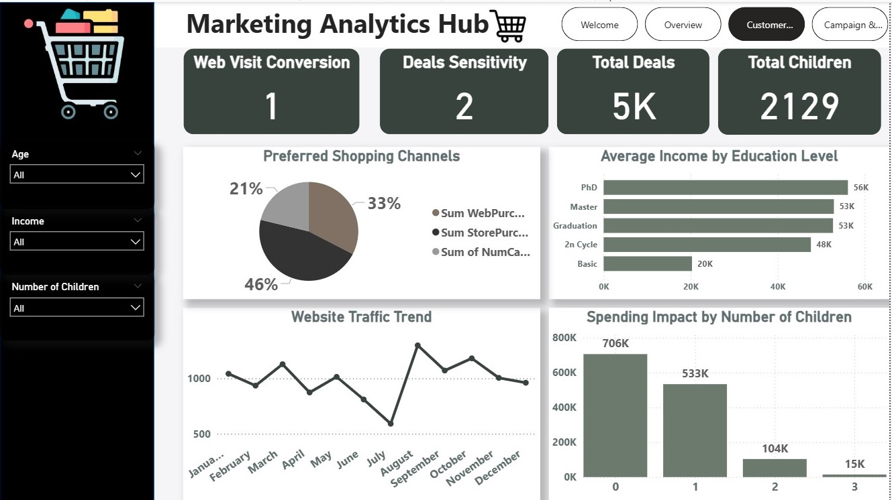
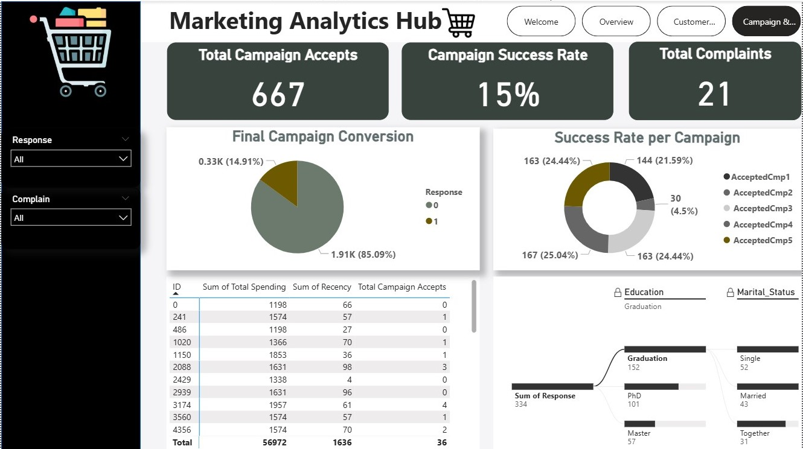

# 🛒 Marketing Analytics & Customer Segmentation Dashboard

## 1. 📊 Interactive Dashboard Preview
This project features a multi-page dynamic dashboard designed in Power BI to analyze customer behavior and marketing performance.

### 🖥️ View 1: Marketing Overview

*Breakdown of total sales, average income, and customer demographics (Education & Marital Status).*

---

### 🖥️ View 2: Customer Behavior Deep-Dive

*Analysis of purchasing habits based on age, income brackets, and household composition.*

---

### 🖥️ View 3: Campaign Performance & Loyalty

*Tracking success rates of marketing campaigns, customer complaints, and shopping channel preferences.*

---

## 📝 2. Executive Summary
This project analyzes a comprehensive marketing dataset to understand **Customer Profiles** and **Campaign ROI**. The goal is to identify which customer segments are most profitable and how they respond to different marketing channels (Web, Store, Catalog).

### 📈 Key Performance Indicators (KPIs):
* **Total Revenue:** Total sales generated across all categories.
* **Customer Base:** Segmentation by Education (PhD, Graduation, etc.) and Marital Status.
* **Campaign Conversion:** Analysis of how many customers accepted the marketing offers.
* **Purchase Channels:** Comparing performance between Web, Store, and Catalog sales.

---

## 🔍 3. Analytical Insights

### A. Customer Demographics
* **Education Impact:** Identification of high-spending segments based on academic background.
* **Family Dynamics:** How the number of children and marital status influence spending patterns in the supermarket.

### B. Campaign Effectiveness
* **Response Rate:** Analysis of the most successful campaigns and the profile of customers who "Accepted" the offers.
* **Recency & Loyalty:** Understanding the time gap since the last purchase and its effect on customer churn.

### C. Spending Behavior
* **Product Preference:** Analysis of spending on different categories (Fruits, Meat, Fish, Gold, etc.).
* **Income vs. Spending:** Correlation between annual income and the total amount spent on the platform.

---

## 🛠️ 4. Data Methodology & Engineering
* **Data Cleaning:** Handled missing values in the Income column and removed outliers.
* **Feature Engineering:** Categorized customers into Age Groups and Income Brackets for better segmentation.
* **DAX Measures:** Created custom measures for Total Spending, Average Purchase Value, and Response Rates.
* **Visualization:** Built an interactive experience using Slicers for dynamic filtering by Education and Campaign Response.

---

## 💡 5. Strategic Marketing Recommendations
1. **Targeted Campaigns:** Focus premium product offers on the high-income segments identified in the Behavior dashboard.
2. **Channel Optimization:** Boost web-exclusive deals if the data shows a high volume of "Web Purchases" in specific age groups.
3. **Retention Strategy:** Re-engage customers with high "Recency" scores (who haven't visited in a long time) with personalized loyalty discounts.

---

## 📂 Repository Structure
* `Marketing_Analytics.pbix`: Final Power BI Dashboard file.
* `Marketing_Data.csv`: Cleaned dataset used for analysis.
* `SharedScreenshot1.jpg`: Dashboard Overview image.
* `SharedScreenshot2.jpg`: Customer Behavior image.
* `SharedScreenshot3.jpg`: Campaign Analytics image.
